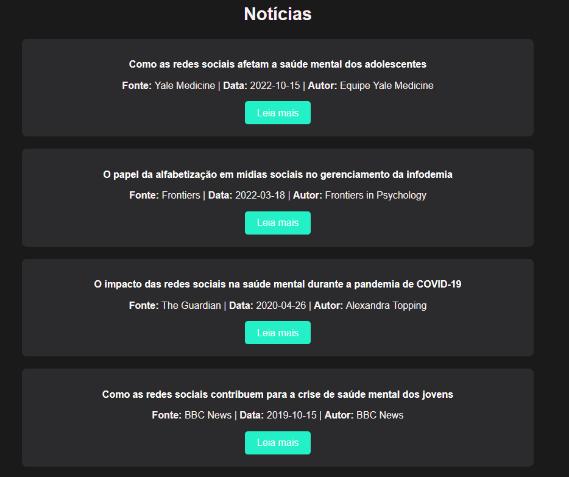

# Introdução

Informações básicas do projeto.

* **Projeto:** Dopamina em tempos de Infodemia
* **Repositório GitHub:** [T1-1-PPL-CC-M-2024-2-Ghost](https://github.com/ICEI-PUC-Minas-PPLCC-TI/ti-1-ppl-cc-m-2024-2-G8-Infodemia)
* **Membros da equipe:**

  * [Diego Henrique Xavier dos Santos](https://github.com/Diego-Hxs) 
  * [Guilherme Henrique Soares França](https://github.com/beltrano) 
  * [Iara Lima Publio](https://github.com/iarapublio)
  * [Leandro Rodrigues Marques](https://github.com/leandro-rodri) 
  * [Letícia Beatriz da Silva Lopes](https://github.com/lehsiilva) 
  * [Rafael Georgetti Grossi](https://github.com/xendak) 

A documentação do projeto é estruturada da seguinte forma:

1. Introdução
2. Contexto
3. Product Discovery
4. Product Design
5. Metodologia
6. Solução
7. Referências Bibliográficas


<br/><br/>

# Contexto


## Problema

A infodemia se trata da disseminação excessiva de informações, um problema que tem crescido exponencialmente com o avanço da tecnologia. Isso tem gerado impactos negativos na sociedade, como desinformação, problemas psicológicos e dependência de dopamina. Nosso grupo decidiu abordar esse tema por sua relevância atual e presença constante em nosso cotidiano, onde o uso excessivo de celulares é visivelmente desenfreado. 


## Objetivos

Neste projeto, buscamos inibir os efeitos causados pela sobrecarga informacional no desempenho das pessoas, tanto no âmbito acadêmico quanto no profissional e pessoal e auxiliar a lidar com a depedência desse excesso de informações.  Para isso, propomos filtrar as informações de modo a entregar apenas o conteúdo que seja considerado produtivo ou de interesse, otimizando o tempo de uso das telas.

## Justificativa

A motivação deste trabalho foi a construção de um software que pretende abordar e aliviar o problema da *Infodemia*, que impacta diretamente na saúde mental e física das pessoas, e, também, possibilita a existência de "*FAKE NEWS*" para quem tem contato com a internet diariamente, especificamente jovens adultos e estudantes. O problema sera analisado com base em estudos recentes e levantamento de dados realizado pelos autores deste trabalho. 


## Público-Alvo

O público-alvo deste estudo são os jovens adultos e estudantes, especialmente aqueles que utilizam frequentemente a internet e as redes sociais como principal meio de obtenção de informações. A intenção é tornar esses ambientes mais seguros e confiáveis para essa faixa etária, ajudando a diminuir os danos provocados pela exposição a conteúdos distorcidos ou enganosos, ou a exposição contínua de conteúdo sem filtros.


# Product Discovery

## Etapa de Entendimento

Através da ferramenta *Miro*, e da metologia [Design Thinking](https://www.dtgbrasil.com.br/), cria-se a matriz de alinhamento CSD e o mapa de stakeholders conforme o arquivo abaixo, que proporciona uma base para execução das entrevistas qualitativas.


<br/><br/>

### Entrevistas Qualitativas
Todas as entrevistas estão no arquivo:   

<br/><br/> 

1. Como você se sente com a grande quantidade de informações que você recebe na internet?
    - Os entrevistados relataram se sentir sobrecarregados e até mesmo sem controle do que estão fazendo com o bombardeamento de informações que recebem diariamente. Muito do conteúdo que é promovido não se encaixa no perfil dos participantes, que acreditam que isso possa ser um gatilho para pessoas mais sensíveis. Existe, ainda, a ideia de que, com os instrumentos corretos, a internet é um lugar que agrega no seu aprendizado.
2. Como você enxerga o impacto disso em outras pessoas? Você pode contar sobre como isso afetou alguém que você conhece?
    - De acordo com os relatos de pessoas entrevistadas, acredita-se que tanto jovens quanto pessoas mais velhas têm dificuldade em filtrar informações, mas os menos acostumados com a tecnologia podem ser mais afetados. O acesso rápido a informações, especialmente através de plataformas como TikTok e YouTube, está impactando a paciência das pessoas. O próprio público percebe que tem sido afetado por isso, preferindo consumir conteúdo em velocidades aumentadas e se incomodando quando alguém fala devagar. Esse impacto também se estende para interações sociais, como o desconforto com o uso de celulares à mesa e o afastamento de parentes que compartilham desinformação. Um dos entrevistados mencionou um amigo que tomou medidas drásticas, como desinstalar redes sociais para se concentrar melhor no trabalho, usando-as apenas quando necessário.
3. Quais são suas principais fontes de informação? Como você consome esse conteúdo?
    - As principais fontes de informação para os entrevistados são redes sociais como Instagram, TikTok e YouTube. A maioria acessa a internet diariamente, variando entre 6 a 10 horas por dia sendo algumas delas ininterruptas.
4. Você percebe alguma mudança no seu comportamento ou humor após passar muito tempo consumindo informações online? Como isso afeta sua saúde mental?  E física?
    - O consumo de informações online por longos períodos de tempo incentivou o sedentarismo e o isolamento dos entrevistados, que disseram se sentir estressados ao serem privados do acesso à Internet. Houve relatos do sentimento de apatia às atividades do cotidiano e de prejuízo à rotina de sono.
5. Como você lida com isso atualmente?
    - Os participantes lidam com o excesso de informações na internet tentando passar mais tempo desconectados da rede. Isso se prova um desafio para os entrevistados visto que muito de seu trabalho e/ou entretenimento se concentram na internet. Existem participantes que relatam também não tomar nenhuma atitude sobre, se submetendo sem empecilho ao bombardeamento de informações.
6. Qual solução você acha que pode ser tomada para resolver esse problema?
    - As pessoas acreditam que a legislação é um passo importante para monitorar o que é oferecido na internet, especialmente para menores de idade, mas que os pais têm a responsabilidade principal. Para adultos, é uma questão de consciência própria, já que eles possuem acesso a informações sobre os malefícios das redes sociais. Há uma necessidade de maior controle sobre essas plataformas, que são vistas como uma fonte de vício, projetadas para manter as pessoas conectadas o máximo possível. No entanto, muitos não veem uma solução sistêmica para o problema e acreditam que a educação digital é essencial. Essa educação ajudaria as pessoas a impor limites no uso das redes e preservar sua saúde, uma vez que a tecnologia atual não consegue filtrar informações de forma eficaz.


## Etapa de Definição

### Personas

Todas as personas do nosso projeto são jovens adultos com algumas dores em comum como gerenciamento de tempo e problemas psicológicos. Sendo essas dores muitas vezes amplificadas pela infodemia, 

#### Persona 1
1 - Túlio Trindade: É um jovem adulto, estudante e estagiário que tem diversos hobbies, como jogar jogos online e rpg de mesa. Além disso, tem problemas em balancear os estudos, estágio e seu lazer, muitas vezes se distraindo com o celular além de ansiedade. 

<br/><br/> 
\pagebreak

#### Persona 2 
2 - Maria Júlia: É uma jovem adulta, estudante, que adora tocar piano e se dedicar ao estudo da língua inglesa e aprender coisas novas. Também é uma pessoa ansiosa e sempre atenta a redes sociais o que acaba consumindo seu tempo.  

<br/><br/> 
\pagebreak

#### Persona 3  
3 - Augusto Silva: É um jovem adulto, desempregado, apaixonado por música, jogos e principalmente bateria. Ele utiliza o computador para tudo e leva o celular para todo lugar além de uma power bank para garantir que vai estar conectado. Todavia, Augusto tem dificuldade em manter atenção em suas tarefas e se frustra quando as coisa dão errado.  

<br/><br/> 
\pagebreak

# Product Design

Nesse momento, vamos transformar os insights e validações obtidos em soluções tangíveis e utilizáveis. Essa fase envolve a definição de uma proposta de valor, detalhando a prioridade de cada ideia e a consequente criação de wireframes, mockups e protótipos de alta fidelidade, que detalham a interface e a experiência do usuário.

## Histórias de Usuários

Com base na análise das personas foram identificadas as seguintes histórias de usuários:

| EU COMO | QUERO/PRECISO | PARA |
| :---------------------: | :------------------------------------------: | :--------------------------------------: |
| Estagiário | Estímulo | Realizar minhas tarefas sem me distrair |
| Jovem Usuário | Configurar alertas relativos ao uso diário de aplicativos | Gerenciar melhor meu tempo e não usar as redes sociais excessivamente |
| Estudante | Ferramentas | Melhor administrar minhas tarefas |
| Trabalhador | Um planejador | Concluir minhas tarefas com mais eficiência e organização | 
| Pessoa Ansiosa | Diminuir meu contato com distratores digitais | Atingir meus objetivos e diminuir minha ansiedade |
| Músico | Maneiras de filtrar o conteúdo desnecessário | Melhorar meu desempenho | 
| Cidadão | Uma plataforma que integre diversas funcionalidades | Ter acesso à informações de uma maneira fácil |
| Gamer | Limitar meu tempo em jogos | Reduzir o estresse advindo da competitividade online | 
| Gamer | Uma ferramenta de análise para meus jogos | Ter sucesso em meus hobbies |


## Proposta de Valor

Proposta de Valor Túlio Trindade  
<br/><br/>
<br/><br/>
<br/><br/>

<br/><br/> 

Proposta de valor Maria Júlia  
<br/><br/> 
<br/><br/> 
<br/><br/> 

<br/><br/> 

\pagebreak
Proposta de valor Augusto Silva  
<br/><br/> 
<br/><br/> 
<br/><br/> 

<br/><br/> 

## Requisitos

As tabelas que se seguem apresentam os requisitos funcionais e não funcionais que detalham o escopo do projeto.

### Requisitos Funcionais

| ID     | Descrição do Requisito                                   | Prioridade     |
| ------ | ---------------------------------------------------------- | ---------- |
| RF01   | Exibir uma introdução e visão geral do site.               | Essencial  |
| RF02   | Fornecer links para as seções principais.                  | Essencial  |
| RF03   | Disponibilizar artigos educativos sobre infodemia e desinformação. | Essencial  |
| RF04   | Incorporar vídeos e podcasts relacionados.                 | Essencial  |
| RF05   | Incluir uma seção de FAQs com perguntas frequentes e respostas. | Importante |
| RF06   | Oferecer guias e eBooks para download.                     | Essencial  |
| RF07   | Disponibilizar exercícios interativos para autoavaliação.  | Importante |
| RF08   | Fornecer links para suporte profissional e organizações de combate à infodemia. | Importante |
| RF09   | Desenvolver um diário de progresso para monitoramento pessoal. | Essencial  |
| RF10   | Fornecer alertas e lembretes para suporte contínuo.        | Essencial  |
| RF11   | Implementar área de cadastro e login para acesso a recursos personalizados. | Essencial  |
| RF12   | Incorporar um sistema de notificações e mensagens para atualizações e suporte. | Importante |
| RF13   | Fornecer uma lista de fontes confiáveis.                   | Essencial  |
| RF14   | Disponibilizar uma ferramenta de verificação de notícias.  | Importante |
| RF15   | Fornecer uma seção de notícias atualizadas sobre infodemia. | Importante |

### Requisitos não Funcionais

| ID     | Descrição do Requisito                                   | Prioridade     |
| ------ | ---------------------------------------------------------- | ---------- |
| NRF01  | Ser acessível em dispositivos móveis e desktops.           | Essencial  |
| NRF02  | O tempo de carregamento de cada página não deve exceder 3 segundos. | Importante |
| NRF03  | Garantir a segurança dos dados pessoais e de login dos usuários. | Essencial  |
| NRF04  | Oferecer uma interface amigável e de fácil navegação.      | Importante |
| NRF05  | Ser compatível com os principais navegadores.              | Essencial  |
| NRF06  | Permitir fácil atualização de conteúdo.                    | Importante |
| NRF07  | Suportar múltiplas requisições simultâneas sem degradação perceptível no desempenho. | Essencial  |
| NRF08  | Armazenar de forma criptografada dados sensíveis.          | Essencial  |
| NRF09  | Manter o código bem documentado e estruturado.             | Importante |


## Projeto de Interface

Artefatos relacionados com a interface e a interacão do usuário na proposta de solução.

### Wireframes


##### TELA INICIAL 

A tela de ínicio do nosso site.


<br/><br/> 

#### TELA LOGIN

A tela de login para entrar em nosso site.


<br/><br/> 

#### TELA CADASTRO

A tela de cadastro para se cadastrar em nosso site.


<br/><br/> 

#### TELA COMUNIDADE

Uma parte do site de comunidade, para encontrar suporte caso o usuário precise. 


<br/><br/> 

#### TELA AUTOAVALIAÇÃO

Uma parte do site onde o usuário pode fazer uma auto avaliação de como a infodemia o afeta.


<br/><br/> 

#### TELA RECURSOS

Uma parte do site destinada a diversos conteúdos informativos como vídeos e e-books, e dúvidas frequentes.


<br/><br/> 

#### TELA CONTEÚDO INFORMATIVO

Uma parte do site com artigos, notícias e podcasts para informar o usuário. 


<br/><br/> 

### User Flow


<br/><br/>

### Protótipo Interativo

[Protótipo Interativo (MarvelApp)](https://marvelapp.com/prototype/1b83aa9e)  


# Metodologia

No nosso grupo, adotamos uma metodologia colaborativa com foco em comunicação eficiente e divisão de responsabilidades. Realizávamos reuniões semanais por chamada no Discord, onde discutíamos o progresso das tarefas, identificávamos desafios e definíamos os próximos passos do projeto. Além disso, mantínhamos uma comunicação contínua e ágil através do WhatsApp, permitindo trocas rápidas de informações, alinhamento de ideias e suporte mútuo entre os membros. Essa abordagem híbrida, aliando encontros estruturados a uma comunicação instantânea, garantiu a organização do trabalho e o engajamento de todos.

## Ferramentas

Relação de ferramentas empregadas pelo grupo durante o projeto.

| Ambiente                    | Plataforma | Link de acesso                                     |
| :---------------------------: | :----------: | :--------------------------------------------------: |
| Processo de Design Thinking | Miro       | https://miro.com/app/board/uXjVKn-Si0E=/        |
| Repositório de código         | GitHub     | https://github.com/ICEI-PUC-Minas-PPLCC-TI/ti-1-ppl-cc-m-2024-2-ghost      |
| Protótipo Interativo       | MarvelApp  | https://marvelapp.com/prototype/1b83aa9e  |

## Gerenciamento do Projeto

Durante as etapas de Entendimento e Product Discovery, o grupo realizou todo o trabalho em conjunto. Apos a criação da ideia de software, dividimos conforme a tabela a seguir.

| Tarefa | Responsáveis | 
| :----: | :----------: |
| Apresentação | Guilherme e Iara | 
| Design - Wireframe | Letícia, Leandro e Mariana | 
| Documentação | Diego e Rafael |

# Solução Implementada

Nossa solução para enfrentar os desafios da infodemia foi desenvolver um site que combina conteúdos informativos e ferramentas interativas para ajudar os usuários a se manterem bem informados e a gerenciar melhor o fluxo de informações. O site oferece artigos confiáveis, guias práticos e recursos educacionais que explicam como identificar notícias falsas e interpretar dados corretamente. Além disso, inclui funcionalidades como listas de fontes seguras, dicas de organização digital e ferramentas de planejamento pessoal, ajudando os usuários a administrar o tempo e evitar sobrecarga informacional. Dessa forma, o projeto visa empoderar as pessoas com conhecimento e estratégias para navegar no cenário informativo de maneira crítica e eficiente.

## Vídeo do Projeto

O vídeo a seguir traz uma apresentação do problema que a equipe está tratando e a proposta de solução.

[](https://www.youtube.com/watch?v=LNxV46wO6O8)

## Funcionalidades

Esta seção apresenta as funcionalidades da solução.

##### Funcionalidade 1 - Artigos Educativos

Permite a visualização de uma lista de artigos educativos, com a opção de acessar informações detalhadas de cada artigo.

* **Estrutura de dados:** [Artigos](#ti_ed_artigos)
* **Instruções de acesso:**
  * Abra o site na página Informações.
  * Descrição: Nesta funcionalidade, os usuários podem visualizar uma lista de artigos educativos com informações como título, autor(es) e data de publicação. Ao clicar no botão "Ler Mais" de um artigo específico, o usuário será direcionado para uma página detalhada que apresenta um resumo do artigo e um link para acessá-lo externamente.
* **Tela da funcionalidade**: 


##### Funcionalidade 2 - Podcasts

Permite a visualização de uma lista de podcasts educativos, com a opção de acessar descrições detalhadas de cada episódio e um link para ouvir.

* **Estrutura de dados:** [Podcasts](#ti_ed_podcasts)
* **Instruções de acesso:**
  * Abra o site na página Informações.
  * Descrição: Nesta funcionalidade, os usuários podem explorar uma lista de episódios de podcasts com informações como título, autor e duração. Ao clicar no botão "Ler Descrição" de um episódio específico, o usuário será direcionado para uma página detalhada com a descrição completa do conteúdo e um link para ouvir o podcast externamente.
* **Tela da funcionalidade**:

##### Funcionalidade 3 - Notícias

Permite a visualização de uma lista de notícias relacionadas à saúde mental e redes sociais, com links para acesso externo ao conteúdo completo.

* **Estrutura de dados:** [Notícias](#ti_ed_noticias)
* **Instruções de acesso:**
  * Abra o site na página Informações.
  * Descrição: Nesta funcionalidade, os usuários podem acessar uma lista de notícias com informações como título, fonte, data e autor. Ao clicar no botão "Leia mais" de uma notícia específica, o usuário será redirecionado para uma página externa contendo o conteúdo completo da notícia.
* **Tela da funcionalidade**:


##### Funcionalidade 4 - Livros

Permite a visualização de uma lista de livros relacionados ao tema da infodemia, com a opção de acessar informações detalhadas e links para aquisição ou leitura adicional.

* **Estrutura de dados:** [Livros](#ti_ed_livros)
* **Instruções de acesso:**
  * Abra o site na página Recursos.
  * Descrição: Nesta funcionalidade, os usuários podem explorar uma coleção de livros com informações como título, autor(es), temas, idioma, número de páginas e data de publicação. Cada livro apresenta um botão "Saiba Mais" que direciona para uma página com detalhes adicionais e um link para adquirir ou acessar o livro externamente.
* **Tela da funcionalidade**:


##### Funcionalidade 5 - Vídeos

Permite a visualização de uma lista de vídeos relacionados à infodemia e saúde mental, com links para assistir aos vídeos em plataformas externas.

* **Estrutura de dados:** [Vídeos](#ti_ed_videos)
* **Instruções de acesso:**
  * Abra o site na página Vídeos.
  * Descrição: Nesta funcionalidade, os usuários podem explorar uma galeria de vídeos com informações como título e uma breve descrição do conteúdo. Cada vídeo apresenta um botão "Veja Mais" que redireciona para a plataforma externa onde o vídeo pode ser assistido.
* **Tela da funcionalidade**:


##### Funcionalidade 6 - Links Confiáveis e Perguntas Frequentes

Oferece uma seção de links confiáveis para fontes de notícias e uma lista de perguntas frequentes (FAQ) relacionadas à infodemia e saúde mental.

* **Estrutura de dados:** [Links e FAQ](#ti_ed_links_faq)
* **Instruções de acesso:**
  * Abra o site na página Links Confiáveis e Perguntas Frequentes.
  * Descrição: Nesta funcionalidade, os usuários podem acessar rapidamente links confiáveis para portais de notícias reconhecidos, como G1, UOL, e Folha de S.Paulo. Abaixo dos links, há uma seção de Perguntas Frequentes, onde os usuários podem expandir as perguntas para visualizar respostas detalhadas sobre tópicos relacionados à infodemia, saúde mental e identificação de notícias falsas.
* **Tela da funcionalidade**:


##### Funcionalidade 7 - Cadastro de Vídeos

Permite que administradores registrem, editem e excluam vídeos na plataforma.

* **Estrutura de dados:** [Cadastro de Vídeos](#ti_ed_cadastro_videos)
* **Instruções de acesso:**
  * Acesse esta funcionalidade apenas se for administrador.
  * Abra o site na página Recursos e selecione Adicionar de Vídeo.
  * Descrição: Nesta funcionalidade, os administradores podem adicionar novos vídeos preenchendo campos como título, URL, descrição e tags. Após o cadastro, os vídeos aparecem listados na seção abaixo, onde podem ser visualizados, editados ou excluídos conforme necessário. Cada vídeo listado inclui um botão para assistir, editar ou excluir, juntamente com as tags associadas.
* **Tela da funcionalidade**:


##### Funcionalidade 8 - Cadastro de Livros/E-Books

Permite que administradores registrem novos livros ou e-books na plataforma.

* **Estrutura de dados:** [Cadastro de Livros/E-Books](#ti_ed_cadastro_livros_ebooks)
* **Instruções de acesso:**
  * Acesse esta funcionalidade apenas se for administrador.
  * Abra o site na página Recursos e selecione Registrar E-Books.
  * Descrição: Nesta funcionalidade, os administradores podem adicionar novos livros ou e-books preenchendo campos como título, autores, sinopse, link do e-book, tema, data de publicação, número de páginas, idioma, editora e URL da capa. Após inserir os dados necessários, o botão "Registrar E-Book" permite salvar o item no sistema.
* **Tela da funcionalidade**:


##### Funcionalidade 9 - Autoavaliação

Permite que os usuários realizem quizzes relacionados à infodemia e o acompanhamento do progresso de suas atividades no site.

* **Estrutura de dados:** [Quizzes](#ti_ed_quizzes)
* **Instruções de acesso:**
  * Abra o site na página Ferramentas.
  * Descrição: Nesta funcionalidade, os usuários podem acessar uma lista de quizzes sobre temas relacionados à infodemia. Cada quiz apresenta uma descrição e opções de respostas. Quando o quiz é concluído corretamente, o progresso do usuário é registrado no gráfico de progresso na parte inferior da página. O gráfico acompanha o desempenho geral em vídeos, notícias, artigos, livros, quizzes e podcasts.
* **Tela da funcionalidade**:


## Estruturas de Dados

Registro dos usuários do sistema utilizados para login e para o perfil do sistema

```json
  {
    "id": 1,
    "login": "admin",
    "senha": "123",
    "nome": "Administrador do Sistema",
    "email": "admin@abc.com",
    "role": "admin",
    "artigos": [],
    "podcasts": [],
    "noticias": [],
    "quiz": [],
    "livros" [],
    "videos": []

  }
  
```

Registro de vídeos informativos fornecidos no site 

```json
  {
    "title": "Infodemia e saúde mental",
    "url": "https://www.youtube.com/embed/_S0t1jvN-N0?si=cw6tAYiLTRPhsJlJ",
    "description": "Explore a infodemia e seu impacto na saúde mental. O vídeo aborda como a sobrecarga de informações pode causar ansiedade e estresse, além de oferecer dicas para filtrar dados e promover um ambiente digital saudável, ajudando a preservar o bem-estar mental.",
    "tags": [
    "saúde mental",
    "infodemia",
    "ansiedade",
    "estresse"
    ],
    "id": "f745"
  }
  
```

Registro de FAQS de perguntas dos usuários 

```json
  {
    "id": "1",
    "pergunta": "O que é a infodemia?",
    "resposta": "Infodemia é o excesso de informações, algumas precisas e outras não, que dificulta a tomada de decisões e gera confusão entre as pessoas."
  }
  
```

Registro de eBooks informativos

```json
  {
    "capa": "./assets/images/ebooks/LivroInfodemia.jpg",
    "titulo": "Infodemia",
    "autores": "Geras Barseghyan",
    "sinopse": "Infodemia é um livro filosófico e psicológico que explora como o comportamento humano e o mundo mental interior evolue em meio à infodemia generalizada (uma grande quantidade de notícias falsas, corrosivas e opressivas). Vivemos numa era de vastos fluxos de informação. Diariamente, ingerimos quantidades abundantes de informações e negatividade, muitas vezes inconscientes do seu impacto corrosivo no nosso bem-estar mental. Baseado nas realidades contemporâneas, o livro investiga como a infodemia influencia as relações humanas e quais consequências devastadoras ela pode ter.",
    "link": "https://www.amazon.com.br/Infodemia-English-Geras-Barseghyan-ebook/dp/B0D9SQYYGS?__mk_pt_BR=%C3%85M%C3%85%C5%BD%C3%95%C3%91&s=digital-text&sr=1-2",
    "tema": "Filosofia, Psicologia, Sociologia",
    "publicacao": "19 de Julho de 2024 ",
    "paginas": "195",
    "idioma": "Inglês",
    "editora": "Própria autoria",
    "id": "1"
  }
  
```

Registro de notícias 

```json
  {
    "titulo": "Como as redes sociais afetam a saúde mental dos adolescentes",
    "link": "https://www.yalemedicine.org/news/social-media-teens-mental-health",
    "fonte": "Yale Medicine",
    "data": "2022-10-15",
    "lingua": "Português",
    "autor": "Equipe Yale Medicine",
    "id": "4e20"
  }
  
```

Registro de artigos informativos

```json
  {
    "titulo": "As múltiplas faces da infodemia",
    "autor": "Luís Gonçalves, Leonardo Castro, Raquel Rachid, Marcelo Fornazin.",
    "data": "30 Setembro 2024.",
    "descricao": "Neste artigo, revisamos partes da literatura acadêmica sobre a infodemia buscando preencher uma lacuna de estudos que descrevam a sua existência político-econômica, científica, sociotécnica e psicossocial em geral, ao mesmo tempo em que verifiquem como essa imbricação se encontra com a realidade brasileira. Nesse enquadramento, a infodemia emergiu como uma superabundância problemática de informações sobre saúde, capaz de comprometer seus cuidados individuais e coletivos e que integra conflitos sócio-econômicos e culturais relacionados ao capitalismo neoliberal e periférico. Por isso, encontramos distintas e até antagônicas formas de caracterizar e enfrentar a infodemia. Algumas delas contrastam com os princípios do SUS e da reforma sanitária, especialmente com relação à participação política dos sujeitos atingidos pela infodemia enquanto uma forma de enfrentar o fenômeno e os conflitos de que ela faz parte. Concluímos que, enquanto um fenômeno multideterminado, a infodemia deve continuar sendo pesquisada interdisciplinarmente de modo a contribuir com tal participação política.",
    "imagem": "./assets/images/artigos/artigo1.jpeg",
    "link": "artigo.html",
    "saiba_mais": "https://www.reciis.icict.fiocruz.br/index.php/reciis/article/view/3796",
    "id": "9c65"
  }
  
```

Registro de podcasts informativos

```json
  {
    "titulo": "Infodemia Parte I - Tornando-se fonte primária de informação",
    "descricao": "Elas se proliferam mais rápido do que qualquer vírus de que se tem notícia. Em questão de segundos, podem atravessar cidades, países e oceanos, gerando caos e comprometendo vidas. As fake news sempre nos preocuparam, mas, nos tempos atuais, pedem um alerta ainda maior, pois aumentaram sua dimensão e alcance. O cenário é tão preocupante que a OMS deu ao fenômeno o nome oficial de 'infodemia'. Uma das vacinas para elas é fazer com que as informações verdadeiras cheguem diretamente à população, com clareza e transparência. Nessa série especial do Podcast, vamos discutir o assunto e dar sugestões de meios para organizações tornarem isso possível.",
    "link": "https://open.spotify.com/episode/1rCg3YmsGCjNbQ5K1cr8RS?si=5yITE1MRQV2kRyfWDfM8tg&nd=1&dlsi=c89400dd24984e0a",
    "autor": "Aline Castro",
    "podcast": "Comunicação Pública: Guia de Sobrevivência",
    "data": "27 de abr. de 2020",
    "duracao": "21min 41s",
    "id": "baf2"
  }
  
```

Registro de quizzes e perguntas para o usuário 

```json
  {
"id": "1",
    "title": "Quiz 1: Fundamentos da Infodemia",
    "completed": true,
    "img": "./assets/images/fakenews.png",
    "lastAnswer": {
    "selectedAnswer": 0,
    "isCorrect": true,
    "timestamp": "2024-12-05T01:49:01.403Z"
    },
    "questions": {
    "question": "Qual é o principal impacto da infodemia na sociedade atual?",
    "answers": [
        {
        "text": "Sobrecarga de informações que dificulta a identificação de fontes confiáveis",
        "correct": true,
        "explanation": "A infodemia causa uma sobrecarga informacional que torna difícil distinguir fontes confiáveis de desinformação."
        },
        {
        "text": "Aumento do número de usuários de redes sociais",
        "correct": false,
        "explanation": "Embora relacionado, este não é o principal impacto da infodemia."
        },
        {
        "text": "Melhoria na velocidade de transmissão de dados",
        "correct": false,
        "explanation": "A velocidade de transmissão não é um impacto direto da infodemia."
        },
        {
        "text": "Redução do consumo de notícias online",
        "correct": false,
        "explanation": "Na verdade, a infodemia está associada ao aumento, não à redução, do consumo de informações."
        }
    ]
    }
  }
  
```

## Módulos e APIs

Esta seção apresenta os módulos e APIs utilizados na solução

**Images**:

* Unsplash - [https://unsplash.com/](https://unsplash.com/) ⚠️ EXEMPLO ⚠️

**Fonts:**

* Icons Font Face - [https://fontawesome.com/](https://fontawesome.com/) ⚠️ EXEMPLO ⚠️

**Scripts:**

* jQuery - [http://www.jquery.com/](http://www.jquery.com/) ⚠️ EXEMPLO ⚠️
* Bootstrap 4 - [http://getbootstrap.com/](http://getbootstrap.com/) ⚠️ EXEMPLO ⚠️

> ⚠️ **APAGUE ESSA PARTE ANTES DE ENTREGAR SEU TRABALHO**
>
> Apresente os módulos e APIs utilizados no desenvolvimento da solução. Inclua itens como: (1) Frameworks, bibliotecas, módulos, etc. utilizados no desenvolvimento da solução; (2) APIs utilizadas para acesso a dados, serviços, etc.

# Referências

As referências utilizadas no trabalho foram:

* SOBRENOME, Nome do autor. Título da obra. 8. ed. Cidade: Editora, 2000. 287 p ⚠️ EXEMPLO ⚠️

> ⚠️ **APAGUE ESSA PARTE ANTES DE ENTREGAR SEU TRABALHO**
>
> Inclua todas as referências (livros, artigos, sites, etc) utilizados no desenvolvimento do trabalho.
>
> **Orientações**:
>
> - [Formato ABNT](https://www.normastecnicas.com/abnt/trabalhos-academicos/referencias/)
> - [Referências Bibliográficas da ABNT](https://comunidade.rockcontent.com/referencia-bibliografica-abnt/)
